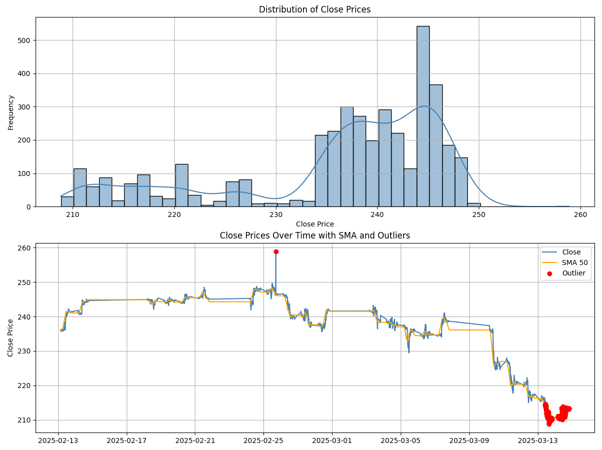
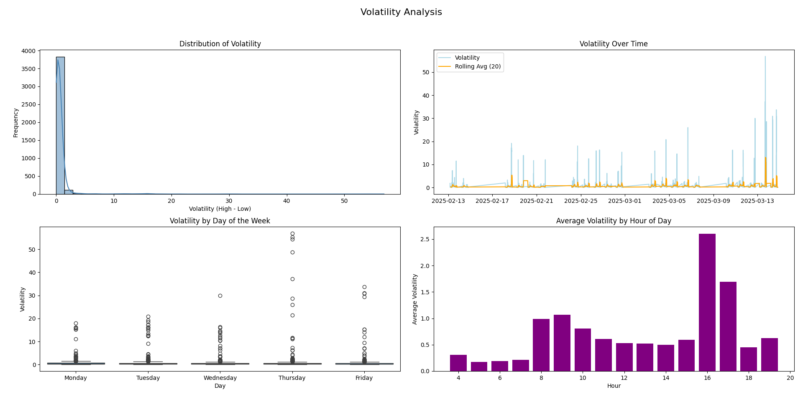
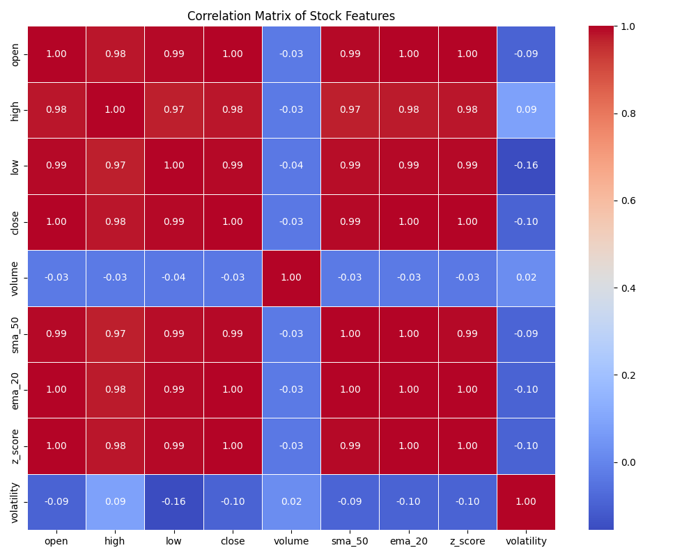
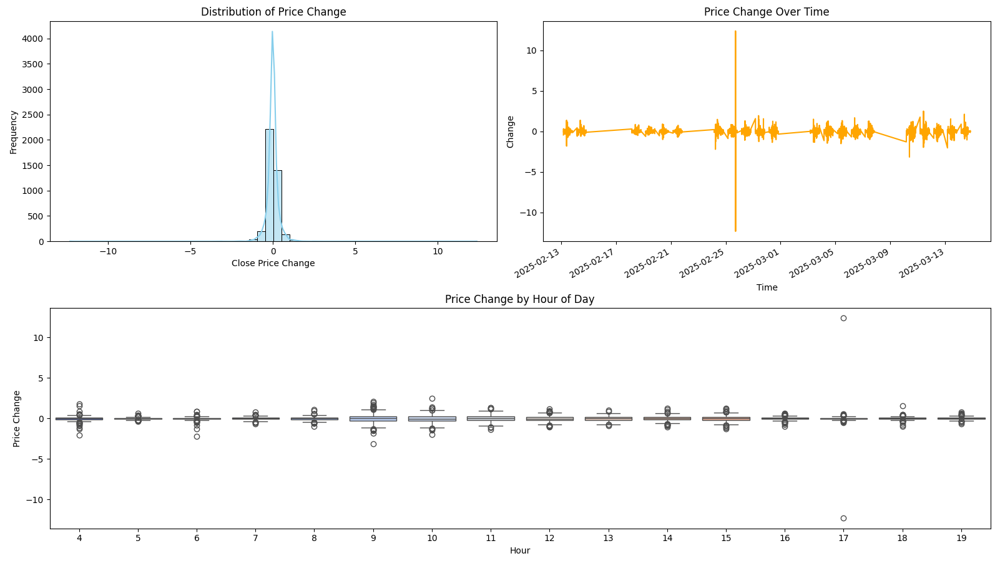

# 📈 Stock Market Data Analysis - AAPL (5-min Interval)

## 🧐 Project Overview
This project performs exploratory data analysis (EDA) on 5-minute interval stock data for Apple Inc. (AAPL). It focuses on uncovering insights and patterns from historical intraday stock data through statistical and visual analysis techniques.

### 📁 Data Source
The dataset used in this project was downloaded from [Alpha Vantage](https://www.alphavantage.co/) and contains 5-minute interval intraday stock data for Apple Inc. (AAPL) between February and March 2025.

---

## 🔧 Tech Stack
- **Python** (Pandas, Matplotlib, Seaborn)
- **MySQL** for data storage
- **dotenv** for environment management

---

## 📂 Dataset
- Data source: JSON file with 5-minute interval trading data
- Columns analyzed:
  - `open`, `high`, `low`, `close`, `volume`
  - Calculated metrics: `sma_50`, `ema_20`, `z_score`, `anomaly`

---

## 📊 Performed Analysis
1. **Renaming columns** for usability (`1. open` ➔ `open`, etc.)
2. **Data cleaning and conversion** of values to correct types
3. **Statistical analysis** of `close` prices:
   - `mean`: 236.17
   - `std`: 10.72
   - `min`: 208.83
   - `max`: 258.88
   - `skewness`: -1.13 ➔ left-skewed distribution
   - `kurtosis`: 0.11 ➔ flat distribution
4. **Outlier detection** using `z_score` (|z| > 2)
5. **Visualization**:
   - Histogram + KDE of `close` prices
   - Line chart of `close` over time with SMA and marked outliers
   - Full volatility analysis with 4 subplots:
     - Distribution of volatility
     - Volatility over time with rolling average
     - Volatility by day of the week
     - Average volatility by hour of the day
   - Correlation matrix of selected numeric features
   - Price change analysis: histogram, time-series, and boxplot by hour

   Visualizations are generated in:
   - `eda_close_prices.py`
   - `eda_volatility.py`
   - `eda_correlation.py`
   - `eda_price_change.py`

---

### 📷 Visualizations

  
*Distribution and time-series view of closing prices with outlier detection.*

  
*Volatility overview across time, weekdays, and trading hours.*

  
*Heatmap of correlation between key financial metrics.*

  
*Distribution, time-series, and hourly boxplot of price changes.*

---

## 📌 Key Insights

- 📉 Downward trend in close prices toward the end of the period
- 🚨 Several significant outliers identified both above and below the trend
- ↘️ Left-skewed distribution shows more frequent lower prices in the range
- 📊 SMA line helped clearly show deviations from the average movement
- 🧨 Kurtosis suggests no heavy tails, so distribution is not extremely volatile

### 🔍 Volatility Insights

- 🔁 Most of the time, volatility is very low, with occasional sharp spikes
- 📆 Volatility varies slightly across weekdays — with Thursdays and Fridays showing more extreme values
- 📉 Rolling average of volatility highlights increasing instability toward the end of the period
- 🕛 Hourly analysis shows that some periods during the trading day consistently exhibit higher average volatility, particularly around 16:00, possibly linked to market close dynamics

### 📈 Price Change Analysis

- 🔄 Price changes between consecutive intervals mostly cluster around zero, with a near-symmetrical distribution
- ⌚ Line chart shows a generally stable trend, with periodic spikes representing rapid price movements
- 🕐 Hourly boxplot reveals slightly wider variability during certain trading hours
- ⚡ One exceptional spike was observed on **2025-02-25 at 17:10**, where the price jumped **+12.38 USD**, followed by a drop of **-12.31 USD** five minutes later — this was retained in the analysis as a rare but plausible event

---

### ⚙️ Setup Instructions

To run this project locally:

1. **Clone the repository**
2. **Create and activate a virtual environment** *(optional but recommended)*:
   ```bash
   python -m venv venv
   source venv/bin/activate   # on macOS/Linux
   venv\Scripts\activate    # on Windows
   ```
3. **Install dependencies**:
   ```bash
   pip install -r requirements.txt
   ```
4. **Create a `.env` file** using `.env.example` as a template:
   ```env
   DB_HOST=localhost
   DB_USER=your_mysql_user
   DB_PASSWORD=your_mysql_password
   DB_NAME=stock_market
   ```
5. **Run the main script** to load and process data:
   ```bash
   python src/main.py
   ```

6. **Run individual EDA scripts** to generate visualizations:
   ```bash
   python src/eda_close_prices.py
   python src/eda_volatility.py
   python src/eda_correlation.py
   python src/eda_price_change.py
   ```